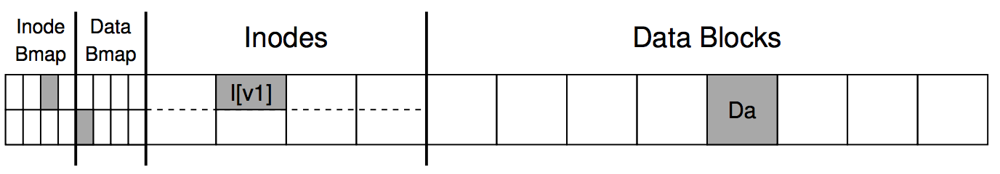
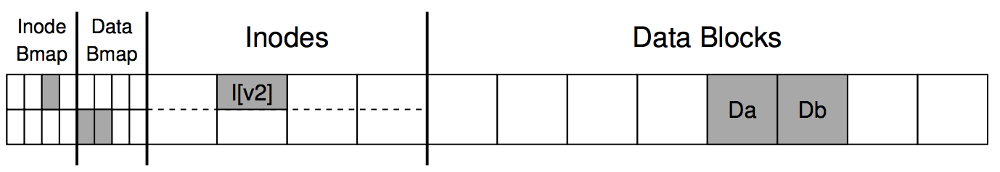
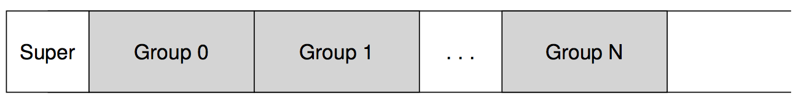
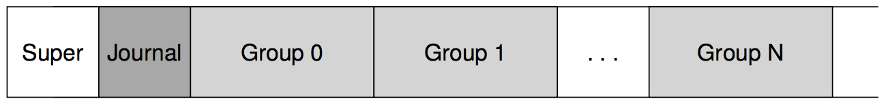
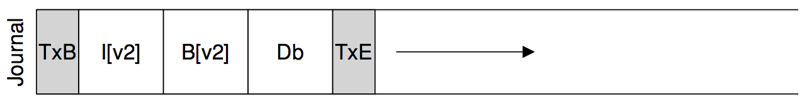
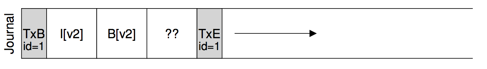
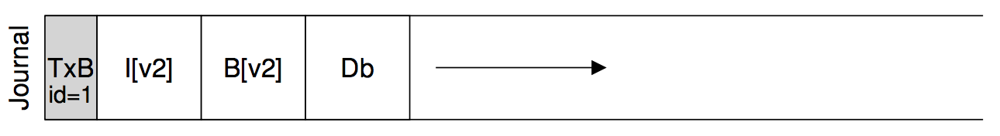
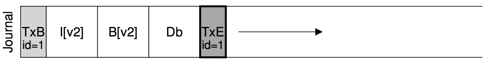
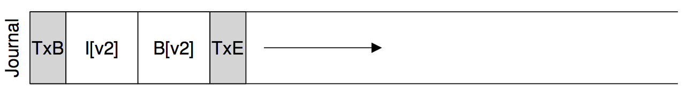

**Crash Consistency: FSCK and Journaling**

* file system data structures must **persist**.
* **power loss** or **system crash** can happen.

什么是**crash-consistency**呢? 比如我写了一个文件, 我可能要进行下面一系列操作.
1. 写inode的结构到磁盘中
2. 写数据.

如果我刚完成步骤1,停电了. 重启电脑后, 我能看到有个文件, 可是居然没有内容. 这是不能容忍的. 我们希望**all or nothing**的原子操作. 本节就要处理这种**不一致**的问题. 通常有两个办法.

1. file system checker(FSCK)
2. journaling(write-ahead logging)

***

# A Detailed Example

假设我们要进行一个简单的操作 : 给存在的一个文件添加一个data block. 步骤如下 :

1. opening the file
2. calling lseek() to move the file offset to the end of the file
3. issuing a single 4KB write to the file before closing it.

然后再假设我们的简单的文件系统结构如下

* 有一个inode bitmap (with just 8 bits, one per inode)
* 有一个data bitmap (also 8 bits, one per data block)
* inodes (8 total, numbered 0 to 7, and spread across four blocks)
* and data blocks (8 total, numbered 0 to 7)

现在这个文件系统中有一个inode,假设是文件A的. 这个文件目前占用了一个data block.

    //inode infomation of file A, 有4个data block指针, 只有一个用了指向DataBlock[4], 如图所示
    owner : zcg
    permissions : read-write
    size : 1
    pointer : 4
    pointer : null
    pointer : null
    pointer : null

进行我们的appending操作后, 文件系统结构如下. 我们更新了三个block, Data Bmap. 一个是Inodes. 还有一个是Data Block.

这时候文件A的inode如下

    owner : zcg
    permissions : read-write
    size : 2
    pointer : 4
    pointer : 5
    pointer : null
    pointer : null

有个非常要注意的点是 : 这些修改后的block通常不会马上写到磁盘, 而是在**page cache**或**buffer cache**呆一段时间. 过了一段时间后, file
system 决定写到磁盘. 之前的appending操作要更新3个block, 如果只更新了1个或者2个, 系统崩溃了, 就会产生不一致.

## Crash Scenarios
接下来, 我们分几种情况细细讨论上面的问题.

### 只写了一个block

* Just the data block (Db) is written to disk.
 * 这种情况下, 就好像没有写过这个文件. 因为InodeBmap和DataBmap好像什么事都没发生一样. 这种情况没问题.
* Just the updated inode (I[v2]) is written to disk.
 * 因为Db没写进去, 但是Inode会告诉我从那里读,会读到垃圾数据.
 * Inode告诉我Db被使用了, 但是DataBmap却告诉我没有, 产生了不一致.
* Just the updated bitmap (B[v2]) is written to disk.
 * 会导致**space leak** 以后再也没办法free Db这个block了.

### 写了两个block

* The inode (I[v2]) and bitmap (B[v2]) are written to disk, but not
data (Db).
 * 会读垃圾数据.
* The inode (I[v2]) and the data block (Db) are written, but not the bitmap (B[v2]).
 * 不一致. inode告诉我用了Db, 但是DataBmap却告诉我那个是free的.
* The bitmap (B[v2]) and data block (Db) are written, but not the
inode (I[v2]).
 * 不一致. 虽然Db块被分配了, 但是没有inode指向它！

 难点 :  disk only commits one write at a time. 要利用unreliable达到reliable的效果. 跟TCP/IP一样！

***

# Solution #1: The File System Checker
**fsck** is a UNIX tool for finding such inconsistencies
and repairing them. 但是这个功能有限. 它只能保证 file system metadata is internally consistent. 像那种 inode 会指向垃圾数据, 但是看上去consistent的情况就没办法处理了, 因为这种情况看上去很对对不对！

** Superblock : **fsck 会检查Superblock看上去是不是正常. 比如已分配块的大小是不是小于总的文件系统大小. 都是一些很general的属性check. 如果不对, 会调出备份的superblock.

** Free blocks : **接下来, fsck会检查inodes和indirect blocks, double indirect block, etc., 收集那些块被分配. 如果 bitmaps和inodes有不一致, fsck会选择相信inode.

** Inode state : ** 然后fsck会检查inode状态对不对, 比如会检查每个inode都有正确的type(regular file, directory, symbolic link等). 如果发现一个问题并且不好解决, fsck就会清理掉这个inode.

** Inode links : ** fsck会检查**link count**. fsck会从根目录开始遍历所有文件夹计算出每个inode的link count, 然后和inode自己内部比较, 不一致就修复. 如果有inode没有directory reference它， 这个文件就会被移动到**lost+found**.

** Duplicates : ** fsck 会检查比如是否有两个inode用到同一个block. 如果一个inode是坏的可以清理掉; 否则可以拷贝一个新的block.

** Bad blocks : ** 如果一个block的位置超出range. 比如只有1000个block, 却要用第2000个block. 这时候fsck只能移掉它了.

** Directory checks : ** fsck会检查**.**和**..**在directory content的最前位置. 也会检查directory里的每个文件是否都被分配了inode.

致命缺点 : **too slow**

***

# Solution #2: Journaling (or Write-Ahead Logging)

ext2

ext3

什么是Group呢，这就是我们前面提到的Fast File System. Linux ext3在ext2的基础上多了一个Journal. 什么是Journal呢? Journal 就是 **Write ahead logging**, 这是从数据库中学到的东西. 当我们要做某一项操作时, 先提前记录我们想要干什么, 记录完后再做我们真正要进行的操作. 当crash发生, 就有机会redo.

## Data Journaling
继续我们之前的例子, 我们要写3个block,分别是inode (I[v2]), bitmap (B[v2]), and data block (Db) . 我们先写到Journal里,结果如下图.

* TxB是一个事务的开始, 包含3个block将要更新到的地址
* TxE是一个事务的结尾, 包含TID(transaction ID)

**checkpoint : ** 将pending的update都写到磁盘确切位置.

因此我们更新3个block的操作就变成
1. **Journal write** : 写TxB, I[v2], B[v2], Db, and TxE to the
journal
2. **Checkpoint** : checkpointing I[v2], B[v2], and Db, to their final locations on disk.

细心的读者们会注意到, 现在我们要写5个block了. 不是比原来写3个更难了么. 确实, 考虑下面的情况

这时候checkpointing认为这是一个正常的事务, 结果就把垃圾数据写进去了.

为了解决这个问题, 我们必须先写TxB, I[v2], B[v2], Db. 等到这4个block写进去了, 再写TxE.

前4个块写完, 等待结束, 写TxE.

TxE是一个512bytes的blocks, 因为硬盘支持512bytes-block的原子操作.

所以, 现在的流程变成
1. Journal write: Write the contents of the transaction (including TxB, metadata, and data) to the log; wait for these writes to complete.
2. Journal commit: Write the transaction commit block (containing TxE) to the log; wait for write to complete; transaction is said to be committed.
3. Checkpoint: Write the contents of the update (metadata and data) to their final on-disk locations.

*不过这种操作比较慢, 因为要等前面块写到磁盘再写TxE. Linux ext4对此有改进. Linux ext4会将所有块一起写, 只不过会多写一个**checksum**. 根据**checksum**就能知道log有没有写成功, 宝宝觉得好聪明!*

***

# Recovery

如果在Journal commit前crash, 我们只需要简单跳过这些pending update; 如果在commit之后crash, reboot机器后, 系统会检查那些committed log, **redo logging**

***

# Batching Log Updates

当你在同一个文件夹下创建文件A和B, 比如说这两个文件的inode可能在同一个block, 或者这两个文件所在的directory的content在一个block. 如果处理不好, 可能我们会在Journal写来写去. 所以 Linux ext3并不会每个更新都建一个trsanction, 而是有一个global transaction 一起更新, 这点很好理解也很合理.

***

# Making The Log Finite

    －－－－－－－－－－－－－－－－－－－－－－－－－－－
    ｜ Tx1 | Tx2 | Tx3 | Tx4 | Tx5 | ---->
    －－－－－－－－－－－－－－－－－－－－－－－－－－－

大家可能会考虑到这样电脑一直跑下去, log会越来越大. journaling file systems 会把log当作一个环形数据结构, 重复利用. 所以有时候也叫**circular log**.

once a transaction has been checkpointed, the file system should free the space it was occupying within the journal, allowing the log space to be reused.

比如我们可以有一个**journal superblock**, 可以标明non-checkpointed transactions在journal superblock里, 其他部分就都是free的. 如下图标明还有5个transaction未checkpointing.

现在, 我们的流程变成了以下4步

1. Journal write: Write the contents of the transaction (containing TxB and the contents of the update) to the log; wait for these writes to complete.
2. Journal commit: Write the transaction commit block (containing TxE) to the log; wait for the write to complete; the transaction is now committed.
3. Checkpoint: Write the contents of the update to their final locations within the file system.
4. Free: Some time later, mark the transaction free in the journal by updating the journal superblock.

***

# Metadata Journaling

读者可能都注意到了每次我们都要写两遍Data block, File System Bandwidth整整拉低了至少一倍, 这是不能容忍的. 这也是上面**data journaling**的巨大缺点.

**Metadata Journaling** 则不把Data写到Journal中而是写到正常的文件系统里,如下图.

所以这样就只需要写一遍data了, 但是问题来了, 我们应该什么时候写data? 稍微想一下应该知道结果了吧, 先写Data, Data写了crash了什么事都没有; 如果先写了Metadata crash了就有事情了(比如会去读垃圾数据). 所以现在整个步骤如下:

1. Data write: Write data to final location; wait for completion (the wait is optional; 只要步骤1,2在3之前完成就行,1,2顺序无关).
2. Journal metadata write: Write the begin block and metadata to the log; wait for writes to complete.
3. Journal commit: Write the transaction commit block (containing TxE) to the log; wait for the write to complete; the transaction (including data) is now committed.
4. Checkpoint metadata: Write the contents of the metadata update to their final locations within the file system.
5. Free: Later, mark the transaction free in journal superblock.

***

# Solution #3: Other Approaches
* Soft Updates
* copy-on-write : LFS
* backpointer-based consistency
* optimistic crash consistency
