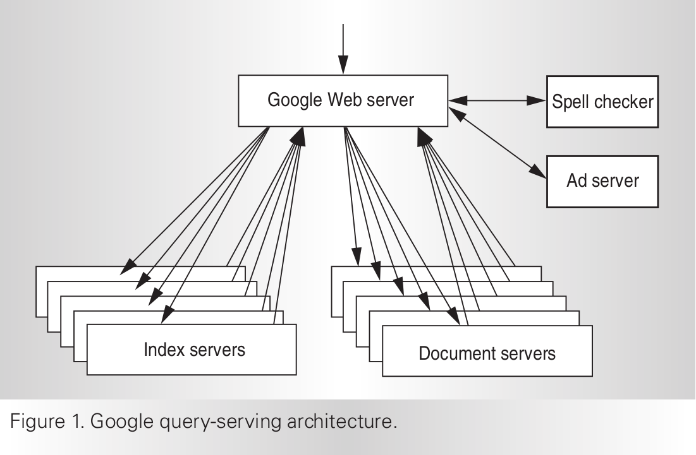

# Google的分布式搜索架构

[WEB SEARCH FOR A PLANET :THE GOOGLE CLUSTER ARCHITECTURE](http://static.googleusercontent.com/media/research.google.com/en//archive/googlecluster-ieee.pdf)

## Serving a Google query

1. 用户查询 www.google.com/search?q=ieee+society
2. **DNS** lookup to map **www.google.com** to a particular IP address, 谷歌在全球有多个集群, 这一步会利用 DNS-based load-balancing system selects a cluster by accounting for the user’s geographic proximity to each physical cluster.
3. The user’s browser then sends a hypertext transport protocol (HTTP) request to one of these clusters. 然后该集群内也有自己的负载均衡策略，会选择该集群内的一台机器处理该请求，处理完后再返回给用户.

**Index Server** : 比如我要查询 梅西&美国. 利用inverted index, 我知道梅西对用Document1,2,4，美国对应Document2,5,7.那么我取一次交集，知道最终要取得Document2.

**Document Server** : Document servers fetching each document from disk to extract the title and the keyword-in-context
snippet. The docserver cluster must have access to an online, low-latency copy of the entire Web.
In fact, because of the replication required for performance and availability, Google stores dozens of copies of the Web across its clusters.

**Spell checker & Ad server** : In addition to the indexing and document-serving phases, a GWS also initiates several
other ancillary tasks upon receiving a query, such as sending the query to a spell-checking system and to an ad-serving system to generate relevant advertisements (if any).

When all phases are complete, a GWS generates the appropriate HTML for the output page and returns it to the user’s browser.
