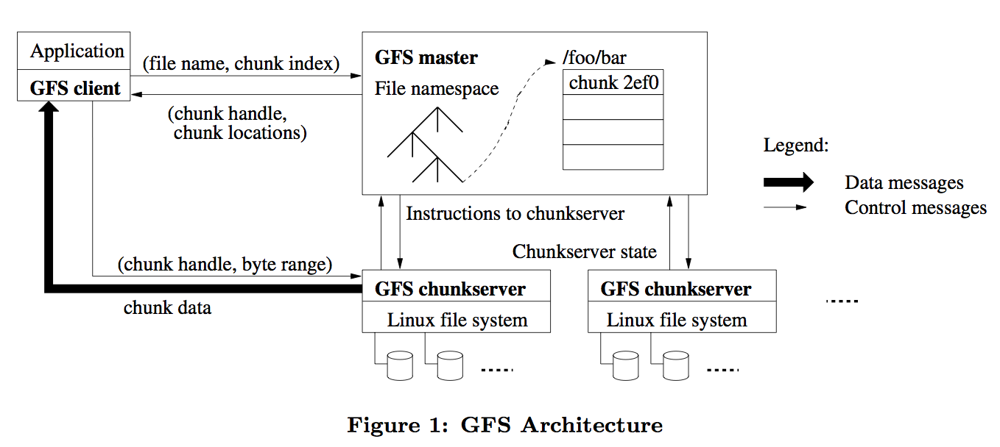
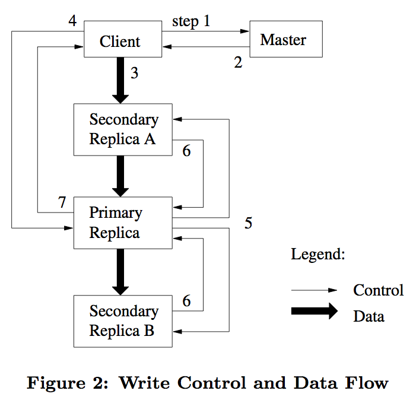

[The Google File System](https://www.google.com/url?sa=t&rct=j&q=&esrc=s&source=web&cd=1&cad=rja&uact=8&ved=0ahUKEwjz9r3BmZzLAhUC5GMKHQDhApEQFggdMAA&url=http%3A%2F%2Fresearch.google.com%2Farchive%2Fgfs-sosp2003.pdf&usg=AFQjCNGzZjh4fvraWMQ94NNgWXhHKqXwhw&sig2=RBWS6by1NUX3qd_UTwaJWw)

* 数据流和控制流分开 : master控制流， chunk server负责数据流. Primary replica负责数据.
* Metadata 在master的memory, 方便快速查询. ** Operation Log ** 和 ** check point ** 搭配负责容错.

* 复制流水线化.
* checksum 保证数据一致性
* Shadow masters : master down掉赶紧接管

***

基本上和HDFS架构差不多. 毕竟HDFS就是从GFS学的.

## 不同点

* Only single-writers per file. 没有GFS的**Record Append**操作.
* HDFS开源.
