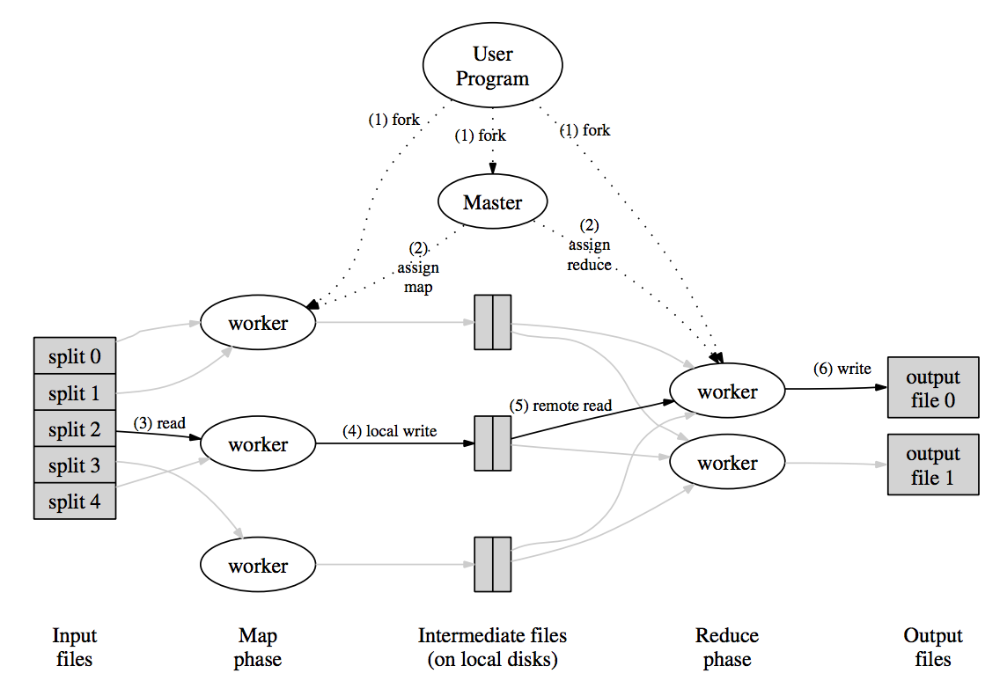

[MapReduce](https://www.google.com/url?sa=t&rct=j&q=&esrc=s&source=web&cd=2&cad=rja&uact=8&ved=0ahUKEwiPuoO5tIjLAhVH1WMKHa8KCBwQFggnMAE&url=http%3A%2F%2Fresearch.google.com%2Farchive%2Fmapreduce-osdi04.pdf&usg=AFQjCNEL7nTxrQ6fiMUtt4AZh6gK5og2IQ&sig2=664kRwHMLNrpOU7DckiwCA&bvm=bv.114733917,d.cGc)

# MapReduce overview

* context: multi-hour computations on multi-terabyte data-sets
 * e.g. experimental analyses of structure of crawled web pages
 * often not developed by distributed systems enthusiasts
 * can be very painful, e.g. coping with failure
* overall goal: non-specialist programmers can easily solve giant
 * data processing problems with reasonable efficiency.
* programmer defines Map and Reduce functions
 * sequential code; often fairly simple
* MR runs the functions on 1000s of machines with huge inputs
 * and hides all details of distribution

# Abstract view of MapReduce
  input is divided into "splits"

    Input Map -> a,1 b,1 c,1
    Input Map ->     b,1
    Input Map -> a,1     c,1
                  |   |   |
                      |   -> Reduce -> c,2
                      -----> Reduce -> b,2
1. MR calls Map() on each split, produces set of k2,v2
    "intermediate" data
2. MR gathers all intermediate v2's for a given k2,
    and passes them to a Reduce call
3. final output is set of < k2,v3 > pairs from Reduce()

# Example: word count
    input is thousands of text files
    Map(k, v)
      split v into words
      for each word w
        emit(w, "1")
    Reduce(k, v)
      emit(len(v))

This model is easy to program; it hides many painful details:
  * concurrency -- same result as sequential execution
  * starting s/w on servers
  * data movement
  * failures

This model scales well.
  * Nx computers get you Nx Map() and Reduce() throughput.
    * Map()s don't wait for each other or share data, can run in * parallel.
    * Same for Reduce()s.
    * Up to a point...
  * So you can get more throughput by buying more computers.
    * Rather than special-purpose efficient parallelizations of * each application.
    * Computers are much cheaper than programmers!

# What about fault tolerance?
  I.e. what if a server crashes during a MR job?

  **Hiding failures** is a huge part of ease of programming!

  Why not re-start the whole job from the beginning?

  * MR re-runs just the failed Map()s and Reduce()s.
    * They are pure functions -- they don't modify their inputs,
      * they don't keep state, there's no shared memory, there's
      * no map/map or reduce/reduce interaction.
    * So re-execution is likely to yield the same output.
  * The requirement for pure functions is a major limitation of
    * MR compared to other parallel programming schemes.
    * But it's critical to MR's simplicity.

# More details (paper's Figure 1):

  * master: gives tasks to workers; remembers where intermediate output is
  * M input splits
  * input stored in GFS, 3 copies of each split
  * all computers run both GFS and MR workers
  * many more input splits than workers
  * master starts a Map task on each server
    * hands out new tasks as old ones finish
  * worker hashes Map output by key into R partitions, on local disk
  * no Reduce calls until all Maps are finished
  * master tells Reducers to fetch intermediate data partitions from Map workers
  * Reduce workers write final output to GFS

# How does detailed design help network performance?
  * Map input is read from local disks, not over network.
  * Intermediate data goes over network just once.
    * Stored on local disk, not GFS.
  * Intermediate data partitioned into files holding many keys.
    * Big network transfers are more efficient.

# How do they get good load balance?
  * Critical to scaling -- otherwise Nx servers -> no gain.
  * But time to process a split or partition isn't uniform.
    * Different sizes and contents, and different server hardware.
  * Solution: many more splits than workers.
    * Master hands out new splits to workers who finish previous tasks.
    * So no split is so big it dominates completion time (hopefully).
    * So faster servers do more work than slower ones, finish abt the same time.

# How does MR cope with worker crashes?
  * Map worker crashes:
    * master re-runs, spreads tasks over other GFS replicas of input.
      * even if worker had finished, since still need * intermediate data on disk.
    * some Reduce workers may already have read failed worker's intermediate data.
      * here we depend on functional and deterministic Map()!
    * how does the master know the worker crashed? (pings)
    * master need not re-run Map if Reduces have fetched all intermediate data
      * though then a Reduce crash would have to wait for Maps to re-run
  * Reduce worker crashes before producing output.
    * master re-starts its tasks on another worker.
  * Reduce worker crashes in the middle of writing its output.
    * GFS has atomic rename that prevents output from being visible until complete.
    * so it's safe for the master to re-run the Reduce tasks somewhere else.

# Other failures/problems:
  * What if the master accidentally starts *two* Map() workers on same input?
    * it will tell Reduce workers about only one of them.
  * What if two Reduce() workers for the same partition of intermediate data?
    * they will both try to write the same output file on GFS!
    * atomic GFS rename will cause the second to finish to win.
  * What if a single worker is very slow -- a "straggler"?
    * perhaps due to flakey hardware.
    * master starts a second copy of last few tasks.
  * What if a worker computes incorrect output, due to broken h/w or s/w?
    * too bad! MR assumes "fail-stop" CPUs and software.
  * What if the master crashes?

# For what applications *doesn't* MapReduce work well?
  * Not everything fits the map/shuffle/reduce pattern.
  * Small data, since overheads are high. E.g. not web site back-end.
  * Small updates to big data, e.g. add a few documents to a big index
  * Unpredictable reads (neither Map nor Reduce can choose input)
  * Multiple shuffles, e.g. page-rank (can use multiple MR but not very efficient)
  * More flexible systems allow these, but more complex model.

# Conclusion
  * MapReduce single-handedly made big cluster computation popular.
  * Not the most efficient or flexible.
  * Scales well.
  * Easy to program -- failures and data movement are hidden.
  * These were good trade-offs in practice.
  * We'll see some more advanced successors later in the course.
  Have fun with the lab!
