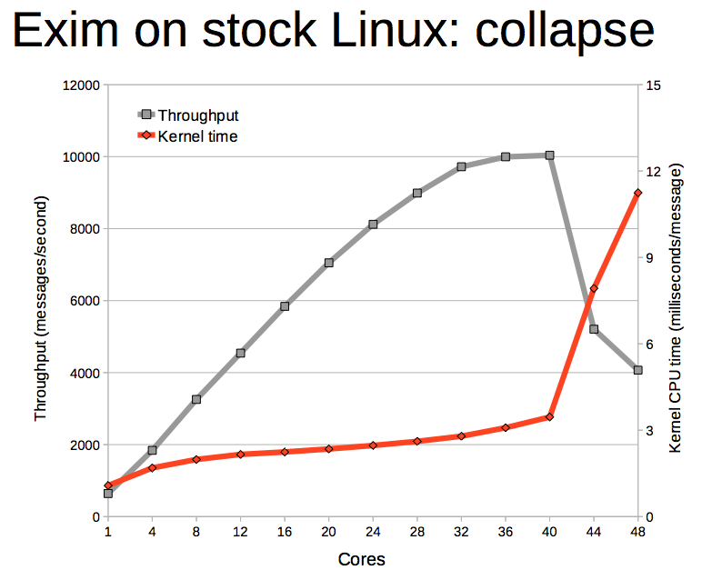
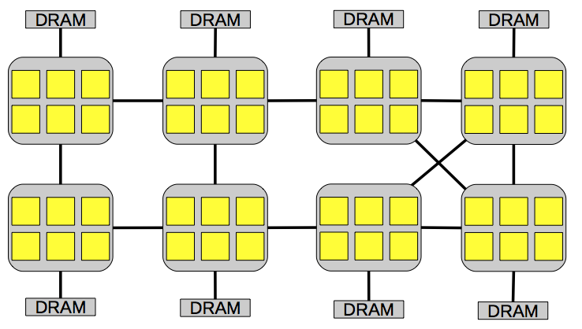
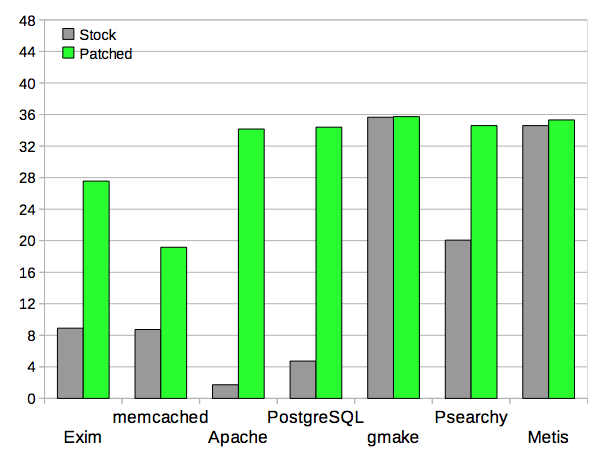

[An Analysis of Linux Scalability to Many Cores](https://www.google.com/url?sa=t&rct=j&q=&esrc=s&source=web&cd=1&cad=rja&uact=8&ved=0ahUKEwj94IPAwabLAhUruYMKHdbpDyoQFggiMAA&url=https%3A%2F%2Fpdos.csail.mit.edu%2Fpapers%2Flinux%3Aosdi10.pdf&usg=AFQjCNFaUKObEOxYjwVZHs-jb2HFJXd75w&sig2=qN3U_T6nK0_poseNMzFmyQ)

[slides](https://www.usenix.org/legacy/event/osdi10/tech/slides/boyd-wickizer.pdf)

[video](https://www.usenix.org/conference/osdi10/analysis-linux-scalability-many-cores)

This paper focus on kernel scalability. Because they think many applications spend a lot of time in kernel. On a uniprocessor, the Exim mail server spends 70% in kernel. If OS kernel doesn't scale, apps won't scale.

They Use a off-the-shelf 48-core x86 machine, running a recent version of Linux to optimize 7 applications. They only modify 3002 lines of code, add 16 patches.

***

# Case Study

From this pic, we can see when cores over 40, it introduces a lot of kernel time. SO WHY?

    samples     %       symbol name
    ---------------------------------
    13515    34.8657    lookup_mnt
    2002      5.1647    radix_tree_lookup_slot
    1661      4.2850    filemap_fault
    1497      3.8619    unmap_vmas
    1026      2.6469    __do_fault
    914       2.3579    atomic_dec
    896       2.3115    unlock_page

We can see many time is wasted in **lookup_mnt**.

Bottleneck: reading mount table

**sys_open** eventually calls:

    struct vfsmount *lookup_mnt(struct path *path)
    {
            struct vfsmount *mnt;
            spin_lock(&vfsmount_lock);
            mnt = hash_get(mnts, path);
            spin_unlock(&vfsmount_lock);
            return mnt;
    }

**spin_lock** and **spin_unlock** takes much time.

    struct spinlock_t {
        int current_ticket;
        int next_ticket;
    }

    void spin_lock(spinlock_t *lock)
    {
        t = atomic_inc(lock->next_ticket);
        while (t != lock->current_ticket)
            ; /*Spin*/
    }

    void spin_unlock(spinlock_t *lock)
    {
        lock->current_ticket++;
    }

This is the architecture, if one CPU holds the lock, if it unlock then it will invalidate other copies of the lock and send new value, which is time-consuming.

So they use per-core mount caches

     struct vfsmount *lookup_mnt(struct path *path)
     {
             struct vfsmount *mnt;

             if ((mnt = hash_get(percore_mnts[cpu()], path)))
                return mnt;

             spin_lock(&vfsmount_lock);
             mnt = hash_get(mnts, path);
             spin_unlock(&vfsmount_lock);
             hash_put(percore_mnts[cpu()], path, mnt);
             return mnt;
    }

***

# Other Tricks

## sloppy counter

Each core can hold a few spare references to an object, in hopes that it can give ownership of these references to threads running on that core, without having to modify the global reference count. More concretely, a sloppy counter represents one logical counter as a single shared central counter and a set of per-core counts of spare references. When a core increments a sloppy counter by V , it first tries to acquire a spare reference by decrementing its per-core counter by V . If the per- core counter is greater than or equal to V , meaning there are sufficient local references, the decrement succeeds. Otherwise the core must acquire the references from the central counter, so it increments the shared counter by V . When a core decrements a sloppy counter by V , it releases these references as local spare references, incrementing its per-core counter by V .

***

# Result

