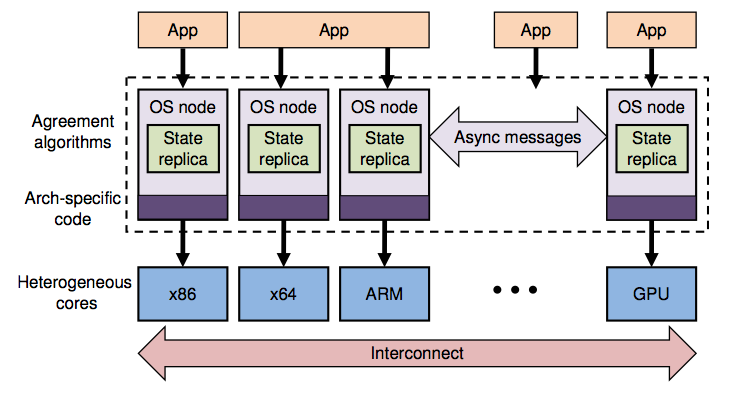
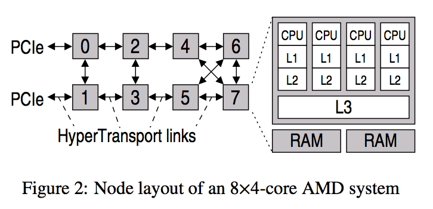
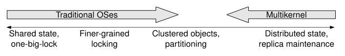
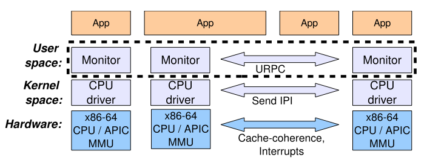

# Multikernel

[Multikernel](http://www.sigops.org/sosp/sosp09/papers/baumann-sosp09.pdf)

***

# Introduction

这是架构, 采用了分布式的思想, 每个OS之间用**message passing**进行通信. 没有**shared memory**这种模型, 因为要保持**coherence**的代价太大了.

我们还可以看到, CPU型号都可以不一样!

# Motivation

1. Systems are increasingly diverse
2. Cores are increasingly diverse
3. The interconnect matters（as previous figure)
4. Messages cost less than shared memory
5. Cache coherence is not a panacea
 * hardware cache-coherence pro- tocols will become increasingly expensive
 * the overhead of cache coherence restricts the ability to scale up to even 80 cores
6. Messages are getting easier

all state is replicated by default and consistency is maintained using agreement protocols

# The multikernel model

Design Principle
1. Make all inter-core communication explicit
2. Make the Operating system structure hardware-neutral
3. View state as replicated instead of shared

## Make all inter-core communication explicit:
* All communication is done through messages
* Use pipelining and batching
 * Pipelining: Sending a number of requests at once
 * Batching: Bundling a number of requests into one message and processing multiple messages together

## Make the Operating System structure hardware-neutral
* Separate the OS from the hardware as much as possible
* Only things that are specific are:
 * Interface to hardware devices
 * Message passing mechanisms
* This lets the OS adapt to future hardware easily.
 * Windows 7 had to change 6000 lines of code in 58 files to improve scalability.

## View state as replicated:
* Operating Systems maintain state
 * Windows dispatcher, Linux scheduler queue, etc.
 * Must be accessible on multiple processors
* Information passing is usually done through shared data structures that are protected by locks
* Instead, replicate data and update by exchanging messages
 * Improves system scalability
 * Reduces:
   * Load on system interconnect
   * Contention for memory
   * Overhead for synchronization
* Replication allows data to be shared between cores that do not support the same page table format
* Brings data closer to the cores that process it.

# Implementation

## System Structure:
* Put an OS instance on each core as a privileged-mode CPU driver
 * Performs authorization
 * Delivers hardware interrupts to user-space drivers
 * Time-slices user-space processes
* Shares no data with other cores
 * Completely event driven
 * Single-threaded
 * Nonpreemptable
* Implements an lightweight remote procedure call table

## Monitors
* Single core user-mode processes, schedulable
* Performs all the inter-core coordination
* Handles queues of messages
* Keeps replicated data structures consistent
 * Memory allocation tables
 * Address space mappings
* Can put the core to sleep if no work is to be done

## Processes:
* Collection of dispatcher objects
 * One for each core it might execute on
* Communication is done through dispatchers
* Scheduling done by the local CPU drivers
* The dispatcher runs a user-level thread scheduler
* Implements a threads package similiar to standard POSIX threads

## Inter-core communication:
* Most communication done through messages
* For now it uses cache-coherent memory
 * Was the only mechanism available on their current hardware platform
* Uses a user-level remote procedure call between cores
 * Shared memory used to transfer cache-line-sized messages
 * Poll on the last word to prevent partial messages

## Memory Management:
* The operating system is distributed
 * Must consistently manage a set of global resources
* User-level applications and system services can use shared memory across multiple cores
* Must ensure that a user-level process can’t acquire a virtual map to a region of memory that stores a hardware page table or other OS object
* All memory management is performed explicitly through system calls
 * Manipulates user level references to kernel objects or regions of memory
 * The CPU driver is responsible for checking the correctness
* All virtual memory management is performed by the user-level code
 * To allocate memory it makes a request for some RAM
   * Retypes it as a page table
   * Send it to the CPU driver to insert into root page table
   * CPU driver checks and inserts it
 * This was a mistake
   * Very complex and not more efficient that conventional OS
