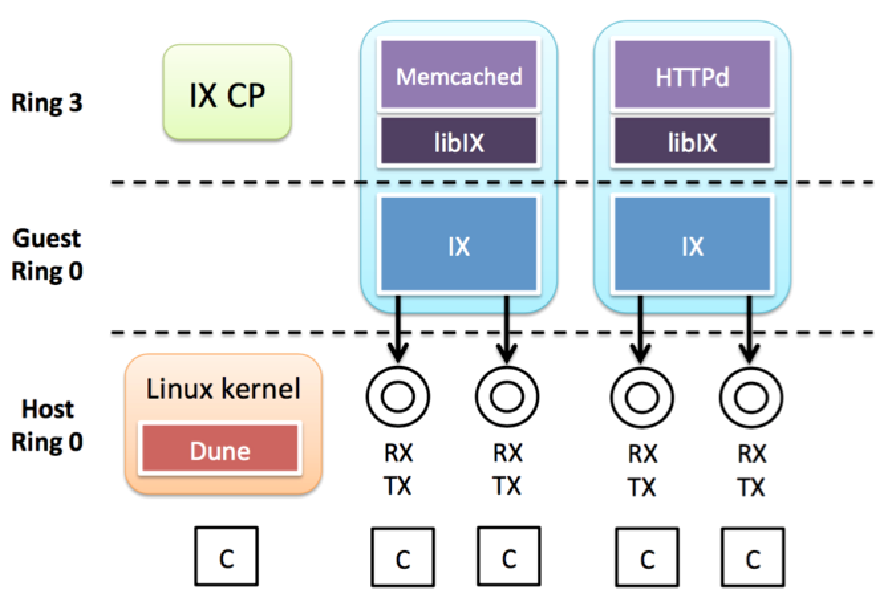
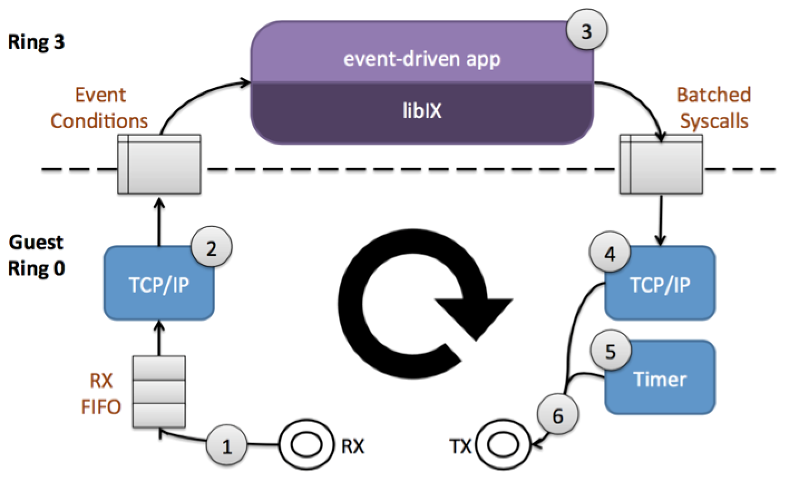

[IX: A Protected Dataplane Operating System for High Throughput and Low Latency](https://www.google.com/url?sa=t&rct=j&q=&esrc=s&source=web&cd=2&cad=rja&uact=8&ved=0ahUKEwjikoa6qofLAhVG-GMKHXCRA00QFggoMAE&url=http%3A%2F%2Fcsl.stanford.edu%2F~christos%2Fpublications%2F2014.ix.osdi.pdf&usg=AFQjCNGVzWkoaQQjDMBK8HWuBPjp1FQfOg&sig2=gqZIqq0dkOtXas2MRunf8Q)

# Background

## Memcached
Memcached 是一套高性能的、分布式内存对象缓存系统. 许多Web应用将数据保存到关系型数据库(RDBMS, 如MySQL)中，服务器从中读取数据并显示在浏览器中。 随着数据量的增大、访问的集中，就会出现RDBMS负担加重,数据库响应恶化, 网站显示延迟等不良问题. 这样, LiveJournal的Brad Fitzpatrick 开发了Memcached, 设计用于加速动态应用程序(比如Web),减轻数据库负载.

## Tail Latency
开发和运维高并发系统的工程师可能都有过类似经验，明明系统已经调优完毕，该异步的异步，该减少互斥的地方引入无锁，该减少IO的地方更换引擎或者硬件，该调节内核的调节相应参数，然而，如果在系统中引入实时监控，总会有少量响应的延迟高于均值，我们把这些响应称为尾延迟(Tail Latency).对于大规模分布式系统来说，尾延迟的影响尤其严重，例如大规模搜索引擎，单个请求可能就会发送到上万台服务器，系统不得不等待尾延迟响应返回之后才能返回给用户.

## mTCP
mTCP是一个的用户级别的TCP堆栈, 用于多核处理器的系统. mTCP从 I/O 包到 TCP 连接管理上进行全方位的优化.

## SO_REUSEPORT
The new socket option allows multiple sockets on the same host to bind to the same port, and is intended to improve the performance of multithreaded network server applications running on top of multicore system

SO_REUSEPORT支持多个进程或者线程绑定到同一端口，提高服务器程序的性能，解决的问题：

* 允许多个套接字 bind()/listen() 同一个TCP/UDP端口
 * 每一个线程拥有自己的服务器套接字
 * 在服务器套接字上没有了锁的竞争
* 内核层面实现负载均衡
* 安全层面，监听同一个端口的套接字只能位于同一个用户下面

其核心的实现主要有三点：
* 扩展 socket option，增加 SO_REUSEPORT 选项，用来设置 reuseport。
* 修改 bind 系统调用实现，以便支持可以绑定到相同的 IP 和端口
* 修改处理新建连接的实现，查找 listener 的时候，能够支持在监听相同 IP 和端口的多个 sock 之间均衡选择。

[reference](http://www.blogjava.net/yongboy/archive/2015/02/12/422893.html)

## epoll
epoll是Linux内核为处理大批量文件描述符而作了改进的poll，是Linux下多路复用IO接口select/poll的增强版本，它能显著提高程序在大量并发连接中只有少量活跃的情况下的系统CPU利用率。 另一点原因就是获取事件的时候，它无须遍历整个被侦听的描述符集，只要遍历那些被内核IO事件异步唤醒而加入Ready队列的描述符集合就行了.

## httpd
HTTP Daemon is a software program that runs in the background of a web server and waits for the incoming server requests. The daemon answers the request automatically and serves the hypertext and multimedia documents over the internet using HTTP.

httpd stands for Hypertext Transfer Protocol Daemon (i.e. web server).

# Motivation

HW is fast, but SW is a bottleneck.

* HW and Workload is changing
 * Dense Multicore +10 GbE
 * Scale out workloads
* Berkeley sockets, designed for CPU time sharing
* Complex Interface & Code Paths Convoluted by Interrupts and Scheduling
* Packet inter-arrival times being many times higher than the latency of interrupts and system call

**IX** Closes the SW Performance Gap
* Protection and direct HW access through virtualization
* Execution model for low latency and high throughput

# IX Design
* Separation and protection of control and data plane
 * Control plane responses for resource configuration, provisioning, ect.
 * Data plane runs for networking stack and application logic
* Run to completion with adaptive batching
 * Data and instruction cache locality
* Native, zero-copy API with explicit flow control
* Flow consistent, synchronization-free processing

# IX implementation

## Separation of Control and Data Plane

It provides full, three-way protection between the control plane, dataplanes, and untrusted aplication code

## Run to Completion with Adaptive Batching

## Interesting responses
[response](http://people.clarkson.edu/~tarselmj/CS644/IX/IX.html)
