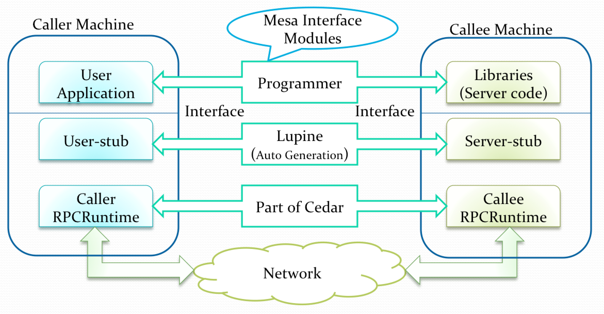
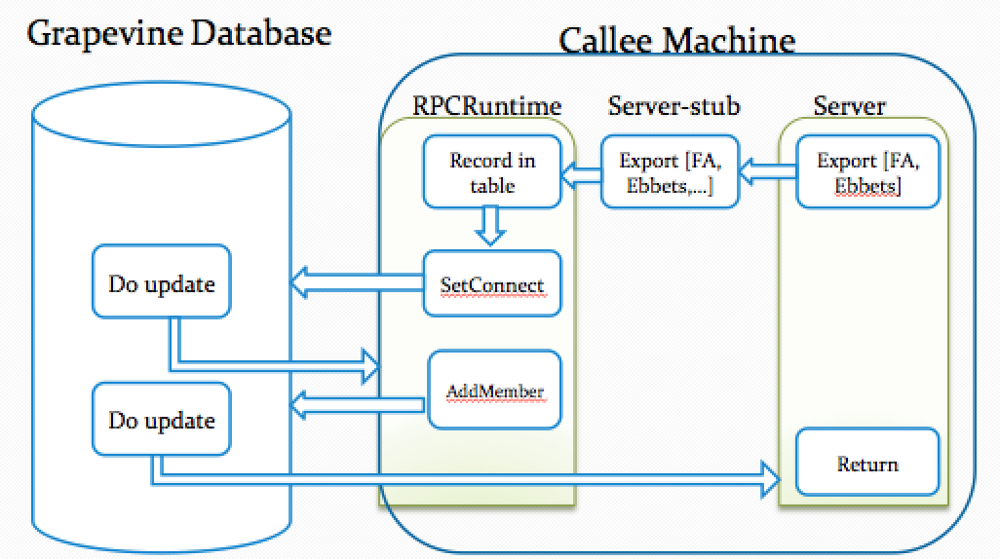
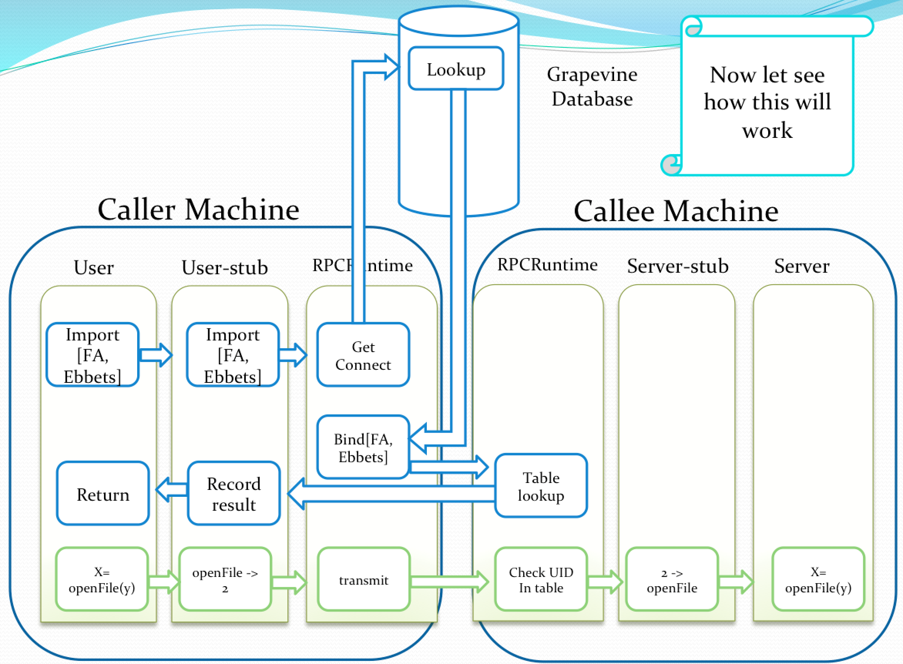

[Implementing Remote Procedure Calls](http://www.cs.virginia.edu/~zaher/classes/CS656/birrel.pdf)

# intro
RPC的概念很简单, 就跟普通procedure call差不多,只不过callee是remote machine而已. 其他的behavior和local procedure call是一样的.

# RPC Facility Structure

* Caller Machine
 * User (user application code module)
 * User-Stub
 * Caller instance of RPCRuntime (RPC communications package)
* Callee Machine
 * Server (server code module)
 * Server-stub
 * Callee instance of RPCRuntime

1. User => Normal procedure call to the corresponding procedure in the user-stub.
2. User-stub => Place target specification + procedure arguments in a packet or more and ask RPCRuntime to transmit them.
3. RPCRuntime =>Responsible for retransmission, acknowledgments, packet routing, and encryption.
4. Server => Contain the server-side modules
5. Server-stub => unpack call-packets and prepare ack + results packets and asks RPCRuntime to transmit them.

# Binding Process

* naming(服务类型) : Which interface the caller expect the callee to implement.
 * Service Name (e.g Mail-server)

* locating(实例, 哪台机器帮我做) : Which particular implementer of an abstract interface is desired.
 * Machine Address (e.g Specific mail-server address)

# Grapevine Database : Locating an appropriate exporter
有时候我们不想实先决定选哪台机器(比如有时候我们甚至还不知道哪些机器可以提供这些服务,很多情况是这样的,所以需要动态请求)

Grapevine Database我感觉和CA差不多,就是有一个trusted的third party,可以告诉我谁谁谁值得信赖啥的. 你请求某个service(邮件服务), Grapevine Database会告诉你哪台机器提供了这个服务. 做你们的协调者.

# Steps of Exporting an Interface

1. ExportInterface=> is given interface name(type, instance) and a procedure (dispatcher)
2. Dispatcher => implemented in the server-stub to handle incoming calls for the interface.
3. ExportInterface => calls Grapevine database and ensures that instance is one of the type members, and the connect-site of the instance is the address of the exporting machine
4. RPCRuntime Table => Interface name, Dispatcher procedure from server-stub, Unique Identifier, and table index
5. Unique Identifier => Has a successive counter, initiated to 1-second-realtime clock, and guaranteed to be less than the current value of that clock

# Steps of Binding An Importer to An Exporter Interface

1. user code call user-stub
2. user-stub calls ImportInterface(Interface type and instance) procedure, in RPCRuntime
3. RPCRuntime asks Grapevine database for the interface exporter’s connect-site (NT Address)
4. Importer machine’s RPCRuntime makes a remote procedure call to RPCRuntime on the exporter machine. Asking for binding information.
5. The table maintained by the Exporter’s RPCRuntime yields the corresponding UID,TableIndex,
6. Then the exporter NT address, UID, and TableIndex remembered by the user-stub

# contempory RPC and data wrangling packages
* [Google RPC](http://www.grpc.io/)
* [Protocal Buffers](https://developers.google.com/protocol-buffers/)
* [JSON-RPC](https://en.wikipedia.org/wiki/JSON-RPC)
* [XML-RPC](https://en.wikipedia.org/wiki/XML-RPC)
* [SOAP](https://en.wikipedia.org/wiki/SOAP)
* 还有Apache Thrift(Hbase中就用了Thrift提供远程调用的接口)
