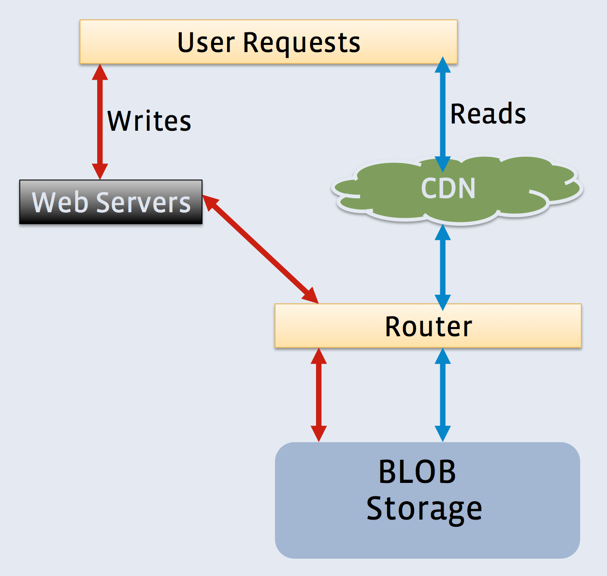
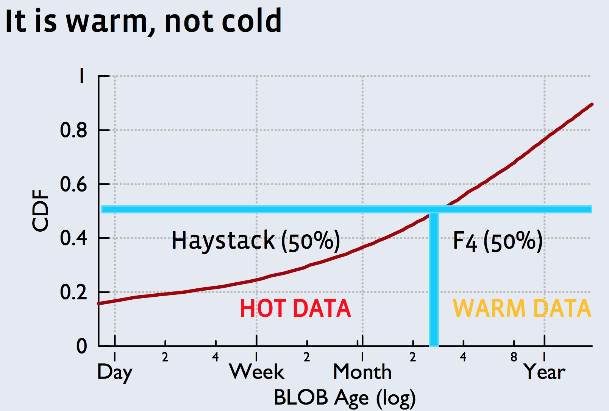

[f4: Facebook's Warm BLOB Storage System](https://www.google.com/url?sa=t&rct=j&q=&esrc=s&source=web&cd=1&cad=rja&uact=8&ved=0ahUKEwihqPGIyJzLAhUUzmMKHdrHC04QFggdMAA&url=https%3A%2F%2Fwww.usenix.org%2Fconference%2Fosdi14%2Ftechnical-sessions%2Fpresentation%2Fmuralidhar&usg=AFQjCNGz7KRrP5Ph1IyH3TrEeNckd8dF3A&sig2=E5zbI-Tn-Q7dA6kFx-jArw)

**f4** 是 **Haystack** 的姐妹系统, 用来存储**Warm data**.

PARTLY COPY FROM [here](http://www.umbrant.com/blog/2014/f4_facebook_warm_blob_storage.html)

***

# Background

Haystack is very good at what it was designed to do: fast random access to write-once blobs. In short, it writes out all these objects log-structured to large 100GB files on the local filesystem, and maintains an in-memory index of blob locations so it can serve up a blob with at most a single disk seek.

The downside of Haystack is that it's not very space efficient. Files are replicated both at the node-level because of **RAID-6** and also geographically three times, leading to a total replication factor of **3.6x** . f4 improves upon this by using erasure coding, which drops the replication factor to **2.1x**. Considering that Facebook has 65PB of warm blobs, we're looking at tens of PBs in savings (meaning millions of dollars).

However, the downside of erasure coding is worsened request rate and failure recovery. With erasure coding, there's only a single data replica that can serve read requests. Failure recovery is more expensive since it requires reading the other data and parity blocks in the stripe. In the meanwhile, clients reads require doing online erasure coding, unless they failover to another datacenter.

It's important to note that f4 was never intended to replace Haystack, but to complement it. They are both fronted by the same CDN, caching, and routing layers, and likely expose similar if not identical APIs. Haystack is great for hot data, and f4 is great for warm data, the key is determining where a given blob belongs.

***

# Determining hotness

Facebook's blobs tend to be accessed frequently when they're first uploaded, after which access rates drops off exponentially. There are a couple different types of blobs, e.g. photos, videos, attachments, and each had different access rates and drop offs. They chose to look at a nifty metric over time: 99th percentile IOPS/TB. Based on synthetic benchmarks, they knew f4's 4TB drives could handle handle 80 IOPS with acceptable latency. This meant a blob wamigration made sense when the IOPS/TB for a type of blob fell below 20.

The other component of hotness is deletion rate. This is important for log-structured systems since compaction (rewriting the file) is required to reclaim space from deleted items. Fortunately, deletions illustrated the same sort of drop-off as request rate.

Profile photos, it turned out, do not exhibit a strong drop off, and are never moved to f4. Photos ended up being hot for about 3 months, and everything else was only hot for one month.

***

# Storage format

Haystack and f4 use the same concept of a volume of blobs. The volume's data file is log-structured and contains a bunch of log-structured blobs. The volume's index file tells you how to find the blobs within the data file, without scanning the entire data file. Once a volume grows to about 100GB, it's locked and the data and index file are immutable. At this point, the volume is a candidate for migration to f4.

One interesting note is that f4 is totally immutable, not even supporting deletes. Through a clever trick though, it does support logical deletes. Each blob is encrypted with a unique encryption key which is stored in an external database. By deleting the encryption key, the blob is effectively also deleted even though the storage space is not reclaimed. The thinking is that the delete rate is low enough that this is desirable to simplify the system. As it turns out, only 7% of data in f4 is deleted in this manner, which isn't too bad compared to the savings from erasure coding, and considering the immense amount of data that would likely have to be rewritten.

***

# Erasure coding
f4 uses Reed-Solomon (10,4) encoding, which means 10 data and 4 parity blocks in a stripe, and can thus tolerate losing up to 4 blocks before they lose the entire stripe. They also use XOR encoding for geographic replication, doing essentially XOR (2,1) encoding across three datacenters. So, their replication factor is 1.4 for the RS (10,4), 1.5 for the XOR (2,1), for a total of 2.1x. Before introducing XOR encoding, they were doing simple 2x replication, so some of their data is still encoded at 2.8x.

Because single data files are so large, f4 can use a large block size of 1GB, and use the ~100 blocks to form stripes. There's no need to stripe at a finer granularity like QFS. It's not clear whether they inline the parity blocks or write them to a side file, but I think it'd be nifty to bulk-import the data and index files directly from Haystack and then just add the parity file later.

# System architecture
Architecturally, f4 bears a strong resemblance to HDFS, which isn't surprising since it's built on top of it. Their name node is highly-available and maintains the mapping between blocks and storage nodes which have the block (the data node equivalent). Storage nodes store and serve the actual data files and index files for volumes. In a diversion from HDFS though, the name node also distributes this mapping to the storage nodes, and in fact clients issue reads and writes directly to storage nodes. This is great because it better distributes load, but does not actually save an RPC since the client still needs to go to the storage node that has the desired blob.

A lot of the additional functionality was also built out as external services that can run on storage-less, CPU-heavy machines.

When online reconstruction is required to serve a client request, this task is handled by a backoff node which issues offset reads to the other blocks in the stripe, and reconstructs from the first ones that come back. This involves only recovering a single blob, not the entire block.

Rebuilder nodes are the counterpart to backoff nodes, and handle background erasure coding. They throttle themselves heavily to avoid affecting foreground client requests. These nodes are actually also responsible for probing for node failures, and report failures to coordinator nodes, which, as it sounds, coordinate recovery tasks. These coordinators also handle fixing up placement violations, if multiple blocks from a single stripe end up on the same rack.

f4 basically glues a new set of soft-state coordinators and workers onto HDFS, rather than baking the functionality into the existing NN and DN. These services likely still require talking to the NN, but this is okay since NNs are not heavily loaded since client load is being handled by storage nodes. This is not true of us, so performance is a real concern, and we typically shy away from the operational complexity of new services since most of our customers are not as sophisticated as Facebook's ops team.

***

# Hardware notes
The big overall theme here is separation of storage, compute, and cache. Storage nodes get to focus only on storage, since the compute-heavy tasks are handled by the new separate services, and the entire blob store is already fronted by multiple levels of caching (so no need for buffer cache). Storage nodes are thus very CPU light, and only need enough memory to be able to fit the blob index and block-node mapping into memory. The index size seems to dominate, and they mention potentially storing it on SSDs.

One other fun note is that they wanted to further downsize their CPUs to save on power, but were unable to do so without sacrificing memory capacity. Intel probably doesn't want to cannibalize their high-end server market. It's also hard to find support for ECC memory in lower-end processors.

They run with a single cluster configuration: 30 4TB drives per 2U host, 14 racks of 15 hosts per cell. Total unformatted capacity per cell is thus 25PB. 14 is the minimum number of racks for RS (10,4) encoding to protect against rack failures. Running with the minimum means a single failure means you can't get back up to full strength, but since they're also doing geographic replication this is kind of okay.

Somewhat obvious, but their network must be fast and plentiful, or else they wouldn't be doing erasure coding at all. It's great to get additional confirmation that this can be done at scale.

Finally, doing the above trace-driven IOPS/TB analysis also let them do hardware provisioning based on their SLOs. They provisioned f4 such that the weekly peak load on any drive is less than the maximum IOPS it can deliver. Those are some pretty strong guarantees on high-percentile latency.

***
# Other misc notes

Constraints leveraged to simplify the design space:

* One workload
* One node, rack, and cluster configuration
* One file size (~100GB), and it's nice and large
* Only have full 1GB blocks
* No appends or deletions
* Fixed erasure coding scheme

From the HDFS developer's perspective:

* Having the block-to-node mapping on their storage nodes is interesting, but probably only possible since their metadata is relatively small. 25PB / 1GB = 25 million blocks, which is pretty manageable compared to some clusters we see.
* Since their recovery nodes are external to the NN, they probably have some way of writing a new block directly to a storage node without going through the NN, or a concat-like API that lets them slide a new block into an existing file.

***

# Conclusion
* Facebook’s BLOB storage is big and growing ▪  BLOBs cool down with age
* ~100X drop in read requests in 60 days
* Haystack’s 3.6X replication over provisioning for old, warm data.
* f4 encodes data to lower replication to 2.1X
