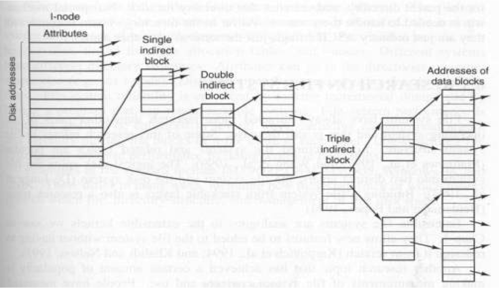
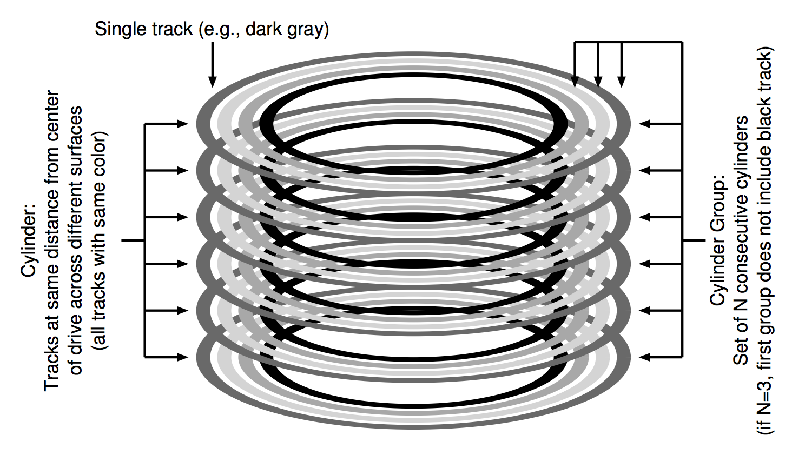
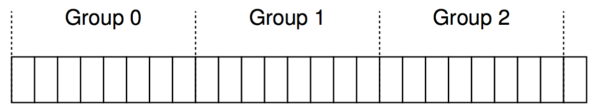
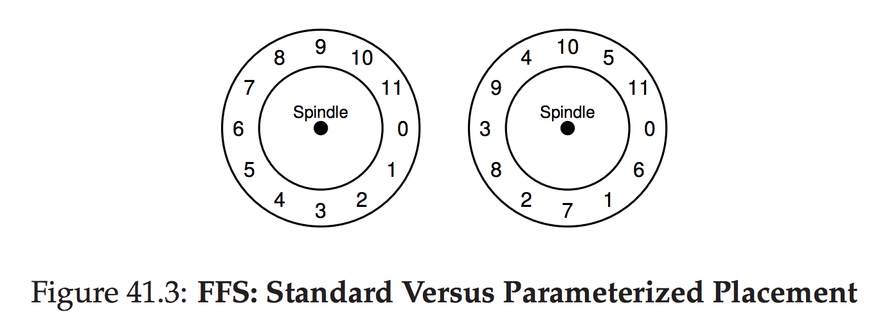

[ A Fast File System for Unix](https://www.google.com/url?sa=t&rct=j&q=&esrc=s&source=web&cd=1&cad=rja&uact=8&ved=0ahUKEwiA6JW8jo_LAhUU-2MKHSaMD-AQFggcMAA&url=https%3A%2F%2Fwww.cs.berkeley.edu%2F~brewer%2Fcs262%2FFFS.pdf&usg=AFQjCNH4c4abCw-XhMfC-NqKFGAq0uTW8w&sig2=Ts4-o9jNPuF94FdYQy6MXQ&bvm=bv.115277099,d.cGc)

***

# Background

## old UNIX file system

    -------------------------------
    | Superblock |  inodes | Data |
    -------------------------------

如图, 这是最早的Unix的文件系统, 小编我也实现过. Superblock包含了整个文件系统的信息: 比如文件系统多大,有多少inode,有多少block 以及 free block list等等. 小编以前实现的如下

    ----------------------------------------------------
    | Superblock | inodemap | blockmap | inodes | data |
    ----------------------------------------------------

拿我的简单实现来说. 如果我的文件系统支持10000个文件, 那么我的inodemap就是bool[10000]. True表示那个inode number已经被分配了. 假设我的data快大小是1MB, 每个block是512Bytes,那么我就有2048个block. 所以我的blockmap是bool[2048]. 下面是我的superblock和inode的结构体，我以前的实现是每个inode占128bytes.

    typedef struct superblock {
      uint32_t size;
      // The number of blocks that the bitmap uses
      uint32_t nblocks;
      // The number of blocks that the inode uses
      uint32_t ninodes;
      } superblock_t;

    typedef struct inode {
      short type;
      unsigned int size;
      unsigned int atime;
      unsigned int mtime;
      unsigned int ctime;
      blockid_t blocks[NDIRECT+1];   // Data block addresses
    } inode_t;

我以前的实现是每个inode分8个block,6个1级block,1个2级block,1个3级block.如下.

缺点就是对磁盘感知太差, 目录放的乱七八糟, 文件放的乱七八糟, inode也放的乱七八糟. 假设我们要访问 /home/user/workspace/a/b/c/work.txt, 我们要先在根目录下找到home的inode, 再从inode中找到block, 再去block中找user......一次次重复这个操作，至少20多次磁盘访问, 如果这些block随机分布, 那么磁盘访问就很慢了. 如果能把这些东西都组织在很近的一块地方, 那么速度就快了.

***

# FFS: Disk Awareness Is The Solution

核心思想就是如何做到"Disk Aware". 伯克利的这帮家伙保持了原来的API, including open(), read(), write(), close(), and other file system calls) 改变了内部的实现.

***

# Organizing Structure: The Cylinder Group

Here is a simple example, showing the four
outer most tracks of a drive with six platters, and a cylinder group that
consists of three cylinders:上图是一个有6个磁盘片和4个磁道的磁盘. 一个cylinder groud(柱面组)由3个柱面组成. 具体的细节宝宝也不是很清楚.

但是现在的硬件并没有透露很多细节给文件系统(比如一个cylinder是否在用), 于是文件系统(比如ext2, ext3, ext4)只能用**block groups**对硬盘进行组织.

不管是cylinder group还是block group, 这就是FFS的核心思想. 如果两个文件在同一个group, FFS能够保证对这两个文件的顺序访问很快.

下面就是每个group的组织方式

    ----------------------------------------------------
    | Superblock | inodemap | blockmap | inodes | data |
    ----------------------------------------------------

跟前面的一模一样. 唯一需要注意的是每个superblock都是原来的一份拷贝, 这是基于可靠性的一种策略.

***

# Policies: How To Allocate Files and Directories

**Key idea** : *keep related stuff together (and its corollary,
keep unrelated stuff far apart)*.

## 如何分配directory
选择那些directory分配的少, free inodes多的group,达到均衡目录和将来快速分配创建文件的目的.

## 如何创建文件
1. 确保数据和inode在相同的group, 防止花大量时间查找inode和数据块.
2. 把属于同一个目录的文件放一起. 如果用户创建了
/dir1/1.txt, /dir1/2.txt, /dir1/3.txt, and /dir99/4.txt, FFS会把前面3个文件放在同一个group. 因为我们假定同一个文件夹下的文件很有可能被连续访问, 合情合理.

***

#  The Large-File Exception
大文件是一个头疼的问题, 因为一个大文件可能会远远大于一个group的size, 然后也会影响原有其他文件的组织. 所以, FFS采取了其他策略来处理大文件. 比如一个大文件可能是100个block的大小. 那么FFS会将前面12个block存在其inode存在的block, 将剩下的block放在一个很低利用率的group.

***

# A Few Other Things About FFS

## fragmentation

FFS采用的Block size是4KB, 我们知道Block size越大, 磁盘使用率肯定越低. 为了解决这个问题, FFS采用了**internal fragmentation**.

在FFS的实现中叫**sub-blocks**, 每一个都是512Bytes. 所以如果新建了一个1KB的小文件, 只会占用两个sub-block而不是整个block. 如果你继续往这个文件里写东西达到4KB后, FFS会将sub-blocks里的内容复制到一个block里, 然后释放掉原来sub-blocks的内容继续使用.

## parameterization

左图是普通文件系统的组织方式. 以前的硬盘不够聪明, 比如我连续访问. 读完第1个的时候磁头可能已经到第3个了, 就错过了第2个；然后FFS采用了右图的组织方式.

**Parameterization**就是说FFS足够聪明, 它能知道要怎么组织结构.

不过现在的硬盘都足够好, 也有**track buffer**. 就不用担心顺序读错过的问题了.

## long file names

之前的文件系统最多只能支持8chars的文件命名. FFS是最早一批支持长文件名命名的文件系统!

## File locking

Old File System
* No provision for locking files
* Main drawbacks
 1. Processes consumed CPU time by looping over attempts to create locks
 2. Locks left lying around because of system crashes had to be manually removed
 3. Process running as sys.admin. were forced to use a different mechanism.

Provides file locking. [ 2 Schemes : **Hard locks** , **Advisory locks** ]

#### Hard locks
* A hard lock is always enforced when a program tries to access a file

#### Advisory locks
* an advisory lock is only applied when it is requested by a program

## symbolic link

现在基本都是symbolic link.

    Unix下跑下面的命令就能建一个软链接, 很方便
    ln -s src dst

一个symbolic link的文件里存的是真实文件的路径. 所以打开symbolic file后,先读取里面的路径, 再根据路径去打开真实文件. 当然, symbolic file也会占用一个inode.

### hard link
1. 硬连接适用于在同一个卷的文件级别，不允许给目录创建硬链接(for fear of introducing loops in the file system hierarchy)
2. 硬连接是不能跨卷的，只有在同一文件系统中的文件之间才能创建链接. (i.e., the inode number must still be meaningful)
3. 硬连接是不会建立inode的，他只是在文件原来的inode link count域再增加1而已，也因此硬链接是不可以跨越文件系统的

### soft link
1. allow the user to create an “alias” to any other file or directory on a system and thus are much more flexible.
2. 软链接可以跨文件系统
3. 软连接会重新建立一个inode，当然inode的结构跟其他的不一样，他只是一个指明源文件的字符串信息

## Quotas
The quota mechanism sets limits on both the number of inodes and the number of disk blocks that a user may allocate.

A separate quota can be set for each user on each file system.

Resources are given both a hard and a soft limit. When a program exceeds a soft limit, a warning is printed on the users terminal; the offending program is not terminated unless it exceeds its hard limit.
