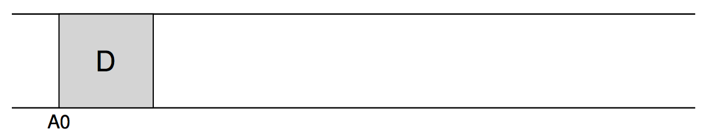
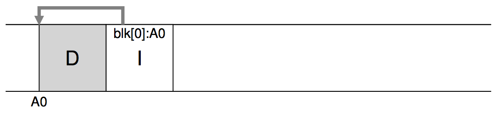
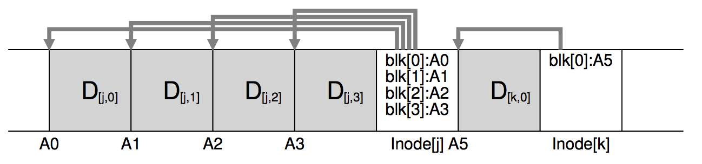
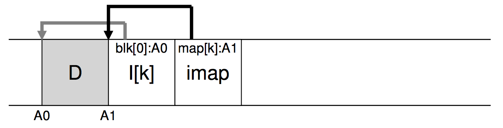
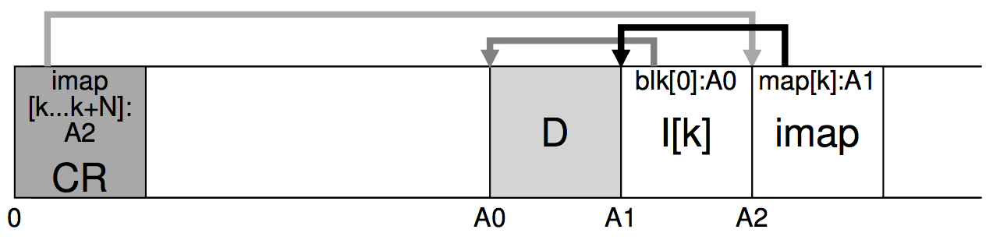
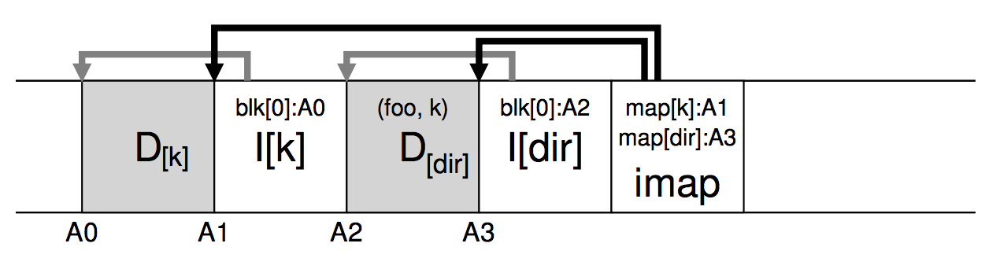
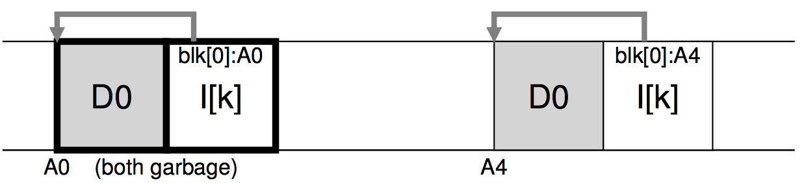
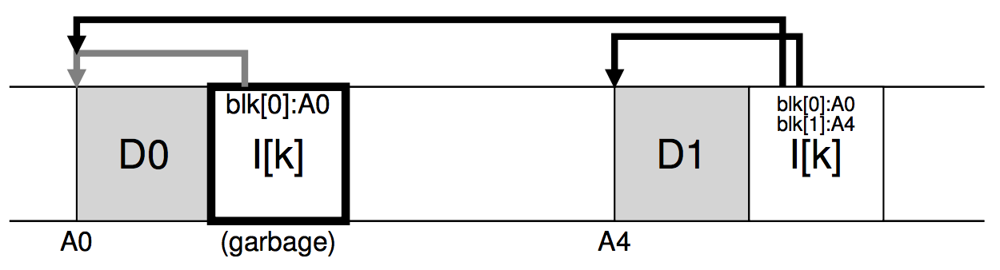
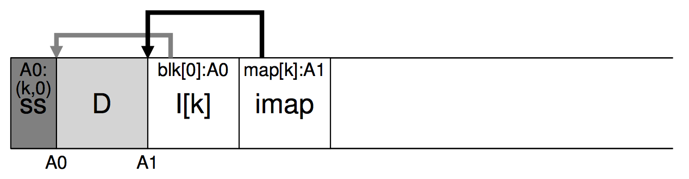

[The Design and Implementation of a Log-Structured File System](https://www.google.com/url?sa=t&rct=j&q=&esrc=s&source=web&cd=1&cad=rja&uact=8&ved=0ahUKEwjXhbHU55DLAhVC6GMKHUWZD1AQFggcMAA&url=https%3A%2F%2Fwww.cs.berkeley.edu%2F~brewer%2Fcs262%2FLFS.pdf&usg=AFQjCNGmCKg5WVvTQeAp2dRIL7VuptfjVQ&sig2=mPi5_3F-BdzCyIfGh8qyHA&bvm=bv.115277099,d.cGc)

随着时代发展
* System memories are growing : 读cache很大读的速度更快, 写却跟不上, 是bottleneck.
* There is a large gap between random I/O performance and sequential
I/O performance
* Existing file systems perform poorly on many common workloads : 虽然很多东西放在同一个block group, 但是create一个文件就需要修改好多block.
* File systems are not RAID-aware : For example, both RAID-4 and
RAID-5 have the **small-write** problem where a logical write to a
single block causes 4 physical I/Os to take place

当LFS写东西时, 它首先缓存所有的update(包括metadata)到一个segment; 当这个segment满了再将这整个segment一次性顺序写到磁盘. LFS不会 overwrites 已经存在的数据而是写到free locations.

***

# Writing To Disk Sequentially
那么问题来了, 如果将一个segment一次性顺序写入呢? 假设我们只写了一个数据块D到位置A0, 情况如下所示

除了写数据块, 我们还要写inode, 如下图.(一个Data block通常是4KB, 一个inode通常是128bytes, 不要在意图的大小...) 这个inode有个指针指向D.

LFS的**Key Idea**就是把所有更新一次性写入磁盘！

# Writing Sequentially And Effectively
但是, 只是简单的顺序写并不表示LFS就能有很高的写速度. 比如先写文件A1, 一段时间后写A2, 这时候磁头可能转动了... 所以LFS用到了我们开头提到的**segment**. 一次性将**segment**里的东西写到磁盘.

我们来看个例子. 下面包含一个segment的写入, 这个segment包含了两个文件的更新. 第一个更新是我们4个block写入文件j, 第二个更新是append一个block到文件k. segment一般有几个MB, 这里只是举个例子.

#  Problem: Finding Inodes
我们知道LFS不会overwrites已有的数据, 每次更新文件新的inodes也会被写到新的地方. LFS没有一个固定的地方存inode. 不像Old Unix File System和FFS, 都可以根据一些静态信息计算出inode的位置. LFS的inode有可能会分布在磁盘的任何位置！

#  Solution Through Indirection: The Inode Map
你可以把它当作一个简单的数组. 输入是一个inode number. 输出是磁盘的位置. 这个Inode Map不会放在固定的地方, 否则又会导致写入很慢, 因为我们会频繁更新. 所以LFS每次都会将一部分imap追加到最新更新的后面. 如图, 这个imap告诉我们文件k的inode在A1, 这个inode告诉我们A1的block在A0.

# Completing The Solution: The Checkpoint Region
那么新的问题产生了, 我们怎么找到imap呢? 因为我们的imap被分成好多份分布在磁盘上了. 所以, 文件系统必须有一个固定的位置, 来帮我们找到这个imap.

在LFS中, 这个位置叫**checkpoint region (CR)** CR一般30s更新一次. 比如如下的 CR有一个item, 告诉我们inode number[k, k+N]处在的imap在A2这个位置.

# What About Directories?
目录和普通文件其实差不多. 当我们对一个文件foo操作后, 我们不仅要修改这个文件的Data Block和inode. 同时也要修改目录的Data block和inode. 如下图

 为了读文件foo. 有如下步骤
 1. 检查imap, 找到对应的dir在A3
 2. 去A3, 找到目录内容在A2.
 3. 去A2, 发现foo的inode number是k
 4. 检查imap, 找到k在A1块
 5. 去A1, 发现block在A0
 6. 去A0读数据

 细心的读者会发现, 如果我要写 A/B/C/foo, 修改了C的inode后, 会revursive影响到上面一层(因为C的inode是新的, B的数据块必须要更新这个item), 最终要影响到根, 这是很糟糕的.

 LFS利用imap巧妙的解决了这个问题. 只要保持相同的name-to-inumber mapping, 每次更新我只反应在imap里. 就是map[dir]指向的块不一样而已.

***

# A New Problem: Garbage Collection

细心的读者可能已经注意到每次我们都会产生新的数据(包括metadata). 老的版本的数据就成为垃圾数据了, 我们不再需要了.

如下图, 我们更新了文件的block, 老的数据(D0和老的inode)就没有用了.

再看下面这个例子, 我们对文件进行了追加, 老的inode就没有用了.

LFS采用** segment-by-segment basis ** 的垃圾回收, 目的是能清理出一大块连续区域来给以后用, 而不是每次清理出坑坑洼洼的很多不连续的小块.

周期性地, LFS会读入一些老的segments. 把其中还在用的block写入到新的segments再释放这些老的连续的segments. 比如, 我们会尝试读入M 个segments, 然后把还在用的数据组织成N 个segments(N < M).

接下来我们面临两个问题. 第一个是怎么确定哪些block还在使用. 第二个是每隔多久清理一次, 怎么选择想要清理的segments.

***

# Determining Block Liveness

给一个segment上的某个block D, 我们必须能辨别这个block是否还在使用中. 为此, 我们给每个segment添加了额外属性描述每个block的使用情况.每个segment的头部有一个**segment summary block**, 描述每个data block属于哪一个inode number以及它的offset(inode 结构体中可以放好多个block).

接下来, 判断block D是否还在使用就很简单了

1. 在segment头部的**segment summary block**查到D的 inode number N 和 offset T.
2. 去imap中找到 N 在哪.
3. 去N的inode 结构体中查第T个block是否是D, 如果不是, 那么D就是垃圾了.

如下图, ss是**segment summary block**. 我们发现D的inode number是k, offset是0. 然后去imap中找到inode k. 发现D还在使用. 于是D就是有用的数据块.

LFS还使用了其他一些技巧加速清理. 当一个文件被截断或者被删除, LFS会增加该文件的**version number**. 只需要比较**SS**中的**verison number**和imap中的**version number**, 如果不一样那么肯定就是没用的data block.

***

# A Policy Question: Which Blocks To Clean, And When?
When
1. periodically
2. idle time
3. the disk is full

Which

利用 **hot and cold segments**. hot就是访问比较频繁的segment, 稍微清理. 现清理cold segments.

***

# Crash Recovery And The Log

## Crash when write to the CR(checkpoint region)

    如下图, 这是checkpoint region. 头尾指向s1, s3. 表示有3个segment可以checkpointing.
    LFS会先写header(包括一个timestamp), 再写segments, 再写tail block(包含相同timestamp)
    CR也会包含imap的指针等有用信息
      |------------------------
      |-------------|         |
      |             |         |
    ------------------------------------------
    |header(time1)| S1 | S2 | S3 | tail(time2)
    ------------------------------------------
如果LFS在写CR crash掉了, 会发现两个timestamp(time1和time2)不一致. 就会抛弃这个CR去寻找最近的consistent的CR.

## Creah when write to a segment
CR大约每隔30s会写一次. 系统会寻找最近的CR, 找到CR指向的imap从而恢复. 但是在最近CR写入后的其他更新会丢掉.

于是LFS从Database那学了一招 **roll forward**. 基本思想是 : 从CR的结尾开始 **仔细检查** 下一个segment. 去看看那里有没有什么有用的信息.

***

NetApp’s **WAFL** 把老版本的文件当成一种feature, 用户可以随时恢复.
