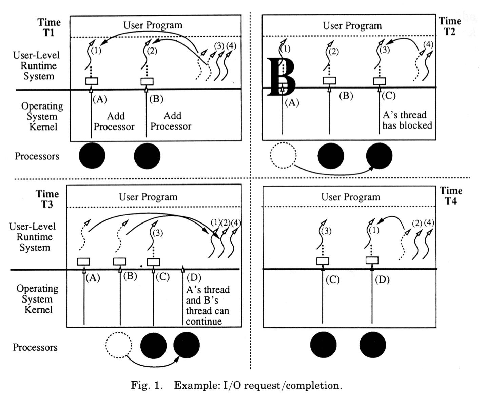

[Scheduler Activations: Effective Kernel Support for the User-Level Management of Parallelism](https://www.google.com/url?sa=t&rct=j&q=&esrc=s&source=web&cd=1&cad=rja&uact=8&ved=0ahUKEwiGrszAvP3KAhUJ2GMKHUrvCeYQFggcMAA&url=http%3A%2F%2Fflint.cs.yale.edu%2Fcs422%2Fdoc%2Fsched-act.pdf&usg=AFQjCNHi1SVJZF7T6nSUNs_wvVEh4qEYiQ&sig2=0JHZuXcEvGsBT1cyZDIokg&bvm=bv.114195076,d.cGc)

## Background

### Spinlock是什么

In software engineering, a spinlock is a lock which causes a thread trying to acquire it to simply wait in a loop ("spin") while repeatedly checking if the lock is available. Since the thread remains active but is not performing a useful task, the use of such a lock is a kind of busy waiting. Once acquired, spinlocks will usually be held until they are explicitly released, although in some implementations they may be automatically released if the thread being waited on (that which holds the lock) blocks, or "goes to sleep".

Because they avoid overhead from operating system process rescheduling or context switching, spinlocks are efficient if threads are likely to be blocked for only short periods. For this reason, operating-system kernels often use spinlocks. However, spinlocks become wasteful if held for longer durations, as they may prevent other threads from running and require rescheduling. The longer a thread holds a lock, the greater the risk that the thread will be interrupted by the OS scheduler while holding the lock. If this happens, other threads will be left "spinning" (repeatedly trying to acquire the lock), while the thread holding the lock is not making progress towards releasing it. The result is an indefinite postponement until the thread holding the lock can finish and release it. This is especially true on a single-processor system, where each waiting thread of the same priority is likely to waste its quantum (allocated time where a thread can run) spinning until the thread that holds the lock is finally finished.

Implementing spin locks correctly offers challenges because programmers must take into account the possibility of simultaneous access to the lock, which could cause race conditions. Generally, such implementation is possible only with special assembly-language instructions, such as atomic test-and-set operations, and cannot be easily implemented in programming languages not supporting truly atomic operations.[1] On architectures without such operations, or if high-level language implementation is required, a non-atomic locking algorithm may be used, e.g. Peterson's algorithm. But note that such an implementation may require more memory than a spinlock, be slower to allow progress after unlocking, and may not be implementable in a high-level language if out-of-order execution is allowed.

`Implementation`

    ; Intel syntax

    locked:                      ; The lock variable. 1 = locked, 0 = unlocked.
     dd      0

    spin_lock:
     mov     eax, 1          ; Set the EAX register to 1.

     xchg    eax, [locked]   ; Atomically swap the EAX register with
                             ;  the lock variable.
                             ; This will always store 1 to the lock, leaving
                             ;  the previous value in the EAX register.

     test    eax, eax        ; Test EAX with itself. Among other things, this will
                             ;  set the processor's Zero Flag if EAX is 0.
                             ; If EAX is 0, then the lock was unlocked and
                             ;  we just locked it.
                             ; Otherwise, EAX is 1 and we didn't acquire the lock.

     jnz     spin_lock       ; Jump back to the MOV instruction if the Zero Flag is
                             ;  not set; the lock was previously locked, and so
                             ; we need to spin until it becomes unlocked.

     ret                     ; The lock has been acquired, return to the calling
                             ;  function.

    spin_unlock:
     mov     eax, 0          ; Set the EAX register to 0.

     xchg    eax, [locked]   ; Atomically swap the EAX register with
                             ;  the lock variable.

     ret                     ; The lock has been released.

## Intro

### Motivation

* Kernel-level threads much better, but still significant overhead
* User-level threads even better, but not well integrated with OS

所以要结合
kernel interface combined with user-level thread package

### Goal

System with the functionality of kernel threads and the performance and flexibility of user-level threads.

* High performance without system calls.
* Blocked thread can cause processor to be used by another thread from same or different address space.
* No high priority thread waits for processor while low priority runs.
* Application customizable scheduling.
* No idle processor in presence of ready threads.

### Challenge

control and scheduling information distributed between kernel and application’s address space.

## scheduler activation
* It serves as a vessel, or execution context, for running user-level threads, in exactly the same way that a kernel thread does.
* It notifies the user-level thread system of a kernel event.
* It provides space in the kernel for saving the processor context of the activation's current user-level thread, when the thread is stopped by the kernel (e.g., because the thread blocks in the kernel on I/O or the kernel preempts its processor).

当程序启动, kernel会create一个scheduler activation,分配这个到一个processor,再call into application address space; 然后就轮到user-level thread management system在activation的context去初始化自己和开始启动main thread.main thread启动后,可能会create其他user threads, 会请求更多processor. 这种情况下, kernel会为每个processor create additional scheduler activation.

## Implementation

* Scheduler activations added to Topaz kernel thread management.
 * Performs upcalls instead of own scheduling.
 * Explicit processor allocation to address spaces.
* Modifications to FastThreads user-level thread package
 * Processing of upcalls.
 * Resume interrupted critical sections.
 * Pass processor allocation information to Topaz.
