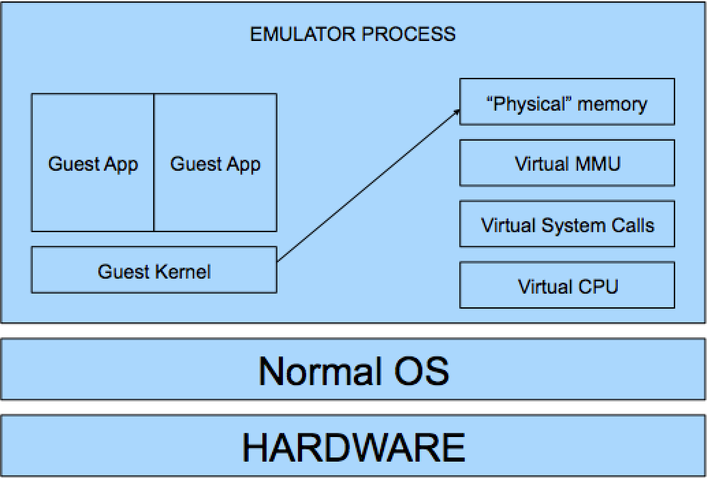

[ Xen and the Art of Virtualization](https://www.google.com/url?sa=t&rct=j&q=&esrc=s&source=web&cd=2&cad=rja&uact=8&ved=0ahUKEwjl4dyQ5vPKAhWDKWMKHShaDJsQFggmMAE&url=http%3A%2F%2Flass.cs.umass.edu%2F~shenoy%2Fcourses%2Ffall07%2Fpapers%2Fxen.pdf&usg=AFQjCNFpaEETsZwSNjP507dnLw1UjkCAJg&sig2=HCV8m1LePZOCZNlUpbgQrg&bvm=bv.114195076,d.cGc)

# How to build a VMM

## Emulation

Do whatever CPU does but ourselves, in software
* Fetch the next instruction
* Decode (is it an ADD, a XOR, a MOV?)
* Execute (using the SW emulated registers and memory)

For example:

    addl %ebx, %eax /* eax += ebx */

Is emulated as:

    enum {EAX=0, EBX=1, ECX=2, EDX=3, ...};
    unsigned long regs[8];
    regs[EAX] += regs[EBX];

Pro: Simple!

Con: Sloooooow...

Example: **BOCHS**  ,   **QEMU**

## Trap and Emulate
Actually, most VM code can execute directly on CPU just fine
* E.g., addl %ebx, %eax

So instead of emulating this code
* Let it run directly on the CPU

But some operations are sensitive and require the hypervisor to lie, e.g.,
* **int $0x80** (generates system call interrupt; hypervisor knows that from now on the guest thinks it’s in privileged mode; guest can’t really run in privileged mode, of course, because otherwise it’d be able to mess stuff up for the host / other guests)
* **movel <something>**, %cr3 (switch virtual memory address spaces; once again, hypervisor can’t allow the guest to actually manipulate address spaces on its own, but it can do it for the guest)
* **I/O ops** (I/O channels are multiplexed by the host so as to allow all the guests to use them, which once again means the hypervisor can’t allow direct access; also, I/O devices handling will not be able to tolerate multiple OSes performing uncoordinated ops)

## Dynamic Binary Translation

## Paravirtualization
